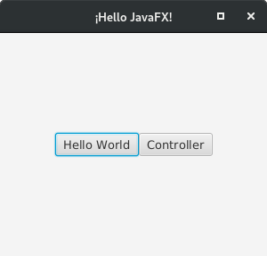

# javafxTest

## Info

Test project for JavaFX, to design GUI without IDE dependencies

## References

- intellij: https://www.jetbrains.com/help/idea/opening-fxml-files-in-javafx-scene-builder.html
- eclipse: https://docs.oracle.com/javafx/scenebuilder/1/use_java_ides/sb-with-eclipse.htm
- netbeans: https://docs.oracle.com/javase/8/scene-builder-2/work-with-java-ides/sb-with-nb.htm
